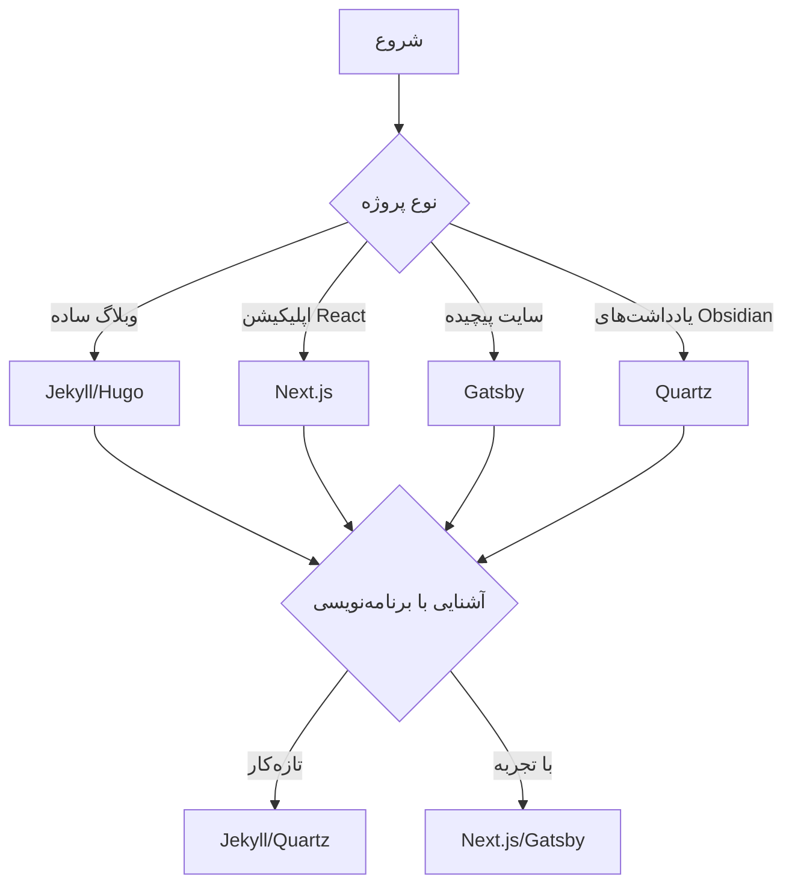
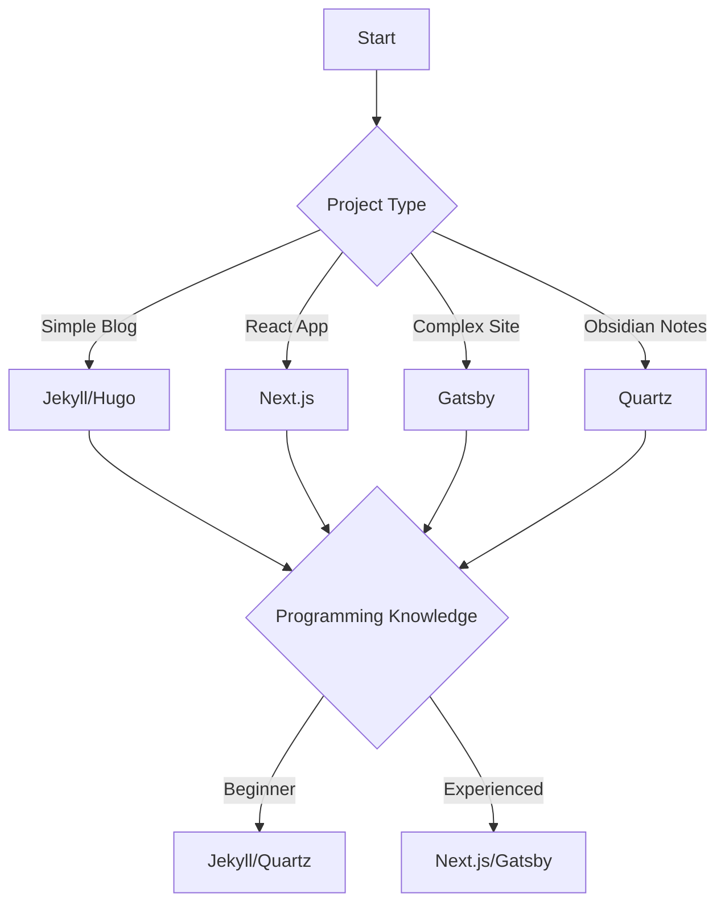

# 🌐 سایت‌سازهای ایستا (SSG)

سایت‌سازهای ایستا (Static Site Generators) یکی از محبوب‌ترین روش‌های ساخت وب‌سایت‌های مدرن هستند. در این مقاله، به طور کامل با این ابزارها آشنا می‌شویم.

## فهرست مطالب

- [SSG چیست؟](#ssg-چیست)
- [نحوه عملکرد](#نحوه-عملکرد)
- [مزایای SSG](#مزایای-ssg)
- [مقایسه با سایر روش‌ها](#مقایسه-با-سایر-روش‌ها)
- [SSG‌های محبوب](#ssgهای-محبوب)
- [کدام SSG انتخاب کنیم؟](#کدام-ssg-انتخاب-کنیم)

## SSG چیست؟

یک سایت‌ساز ایستا (Static Site Generator) ابزاری است که فایل‌های HTML، CSS و جاوااسکریپت وب‌سایت شما را **قبل از** اینکه کاربری از سایت بازدید کند، می‌سازد (در زمان ساخت یا build time).

### 📌 تعریف دقیق

```typescript
interface StaticSiteGenerator {
  // فایل‌های ورودی
  input: {
    content: string[]  // فایل‌های مارک‌داون
    templates: string[] // فایل‌های قالب
    assets: string[]   // تصاویر، استایل‌ها و...
  }

  // فرآیند ساخت
  build: () => {
    // ترکیب محتوا با قالب‌ها
    const pages = combine(content, templates)

    // تولید فایل‌های HTML نهایی
    return pages.map(page => ({
      html: generateHTML(page),
      css: processCSS(page.styles),
      js: processJS(page.scripts)
    }))
  }

  // خروجی نهایی
  output: StaticFiles
}
```

> [!info] نکته مهم

- برخلاف سایت‌های پویا، در SSG هیچ پایگاه داده یا کد سمت سرور در زمان اجرا وجود ندارد.

## نحوه عملکرد

### 🔄 چرخه کاری معمول


### 📝 مراحل دقیق

1. **نوشتن محتوا:** شما محتوای خود را در فایل‌های مارک‌داون می‌نویسید
2. **پردازش:** SSG محتوا را با قالب‌ها ترکیب می‌کند
3. **تولید فایل‌ها:** فایل‌های HTML/CSS/JS نهایی تولید می‌شوند
4. **استقرار:** فایل‌ها روی سرور منتشر می‌شوند
5. **دسترسی:** کاربران به سرعت بالا به محتوا دسترسی دارند

## مزایای SSG

### ⚡ سرعت فوق‌العاده

از آنجایی که صفحات از قبل ساخته شده‌اند:

- نیازی به پردازش سمت سرور نیست
- پایگاه داده پرس‌وجو نمی‌شود
- فقط فایل‌ها به کاربر تحویل داده می‌شوند

```javascript
// مقایسه زمان پاسخ‌دهی (میلی‌ثانیه)
const responseTime = {
  staticSite: 10, // SSG
  dynamicSite: 200, // بدون کش
  dynamicWithCache: 50, // با کش
}
```

### 🔒 امنیت بالا

- حذف پایگاه داده = کاهش سطح حمله
- بدون کد سمت سرور پیچیده
- آسیب‌پذیری‌های کمتر

| تهدید         | سایت پویا | SSG       |
| ------------- | --------- | --------- |
| SQL Injection | ⚠️ خطر    | ✅ ایمن   |
| XSS           | ⚠️ خطر    | ⚠️ خطر کم |
| CSRF          | ⚠️ خطر    | ✅ ایمن   |

### 💰 مقیاس‌پذیری و هزینه کم

```javascript
const hostingCost = {
  staticSite: 0, // رایگان (GitHub Pages)
  dynamicSmall: 10, // $10/ماه
  dynamicLarge: 1000, // $1000/ماه
  staticWithCDN: 0, // رایگان (Netlify, Vercel)
}
```

### 🎨 توسعه آسان

- کنترل نسخه با Git آسان است
- بدون نیاز به دپلوی پیچیده
- تست کردن ساده‌تر است
- محیط توسعه ساده

## مقایسه با سایر روش‌ها

### 📊 جدول مقایسه

| ویژگی        | SSG    | CMS    | SPA    |
| ------------ | ------ | ------ | ------ |
| سرعت         | ⚡⚡⚡ | ⚡     | ⚡⚡   |
| امنیت        | 🔒🔒🔒 | 🔒     | 🔒🔒   |
| سئو          | ✅✅✅ | ✅     | ⚠️     |
| هزینه        | 💚💚💚 | 💚💚   | 💚💚   |
| دینامیک بودن | ⚠️     | ✅✅✅ | ✅✅   |
| پیچیدگی      | 💚💚   | 💚     | 💚💚💚 |

### 💡 کدام برای شما مناسب است؟

```python
def choose_method(your_needs):
    if your_needs == "blog_or_portfolio":
        return "SSG is perfect for you!"

    elif your_needs == "ecommerce_with_dynamic_content":
        return "Consider a CMS or hybrid approach"

    elif your_needs == "complex_application":
        return "SPA with SSR might be better"

    else:
        return "SSG is likely a good starting point"
```

## SSG‌های محبوب

### 🚀 گزینه‌های پیشرو

#### 1. Next.js

```javascript
// Next.js with SSG
export async function getStaticProps() {
  const posts = await getPosts()
  return {
    props: { posts },
    revalidate: 60, // ISR - Incremental Static Regeneration
  }
}
```

- 🌟 محبوب‌ترین انتخاب
- ✅ SSG + SSR + ISR
- 🎯 مبتنی بر React
- 📦 پکیج بزرگ اکوسیستم

#### 2. Gatsby

```javascript
// Gatsby data fetching
export const query = graphql`
  query {
    allMarkdownRemark {
      edges {
        node {
          frontmatter {
            title
            date
          }
        }
      }
    }
  }
`
```

- 🌿 مبتنی بر React
- 📊 GraphQL داخلی
- 🖼️ بهینه‌سازی تصاویر خودکار
- 🔌 پلاگین‌های غنی

#### 3. Hugo

```yaml
# Hugo config
baseURL: "https://example.com"
languageCode: "fa"
theme: "your-theme"
```

- ⚡ سریع‌ترین SSG
- 🚀 مبتنی بر Go
- 📝 مارک‌داون پیش‌فرض
- 🎚️ تنظیمات ساده

#### 4. Jekyll

```yaml
# Jekyll frontmatter
---
title: "My Post"
date: 2024-01-01
tags: [web, programming]
---
```

- 💎 پشتیبانی GitHub Pages
- 💎 مبتنی بر Ruby
- 📝 ساده برای شروع
- 🌐 جامعه بزرگ

#### 5. 11ty (Eleventy)

```javascript
// Eleventy config
module.exports = function (eleventyConfig) {
  eleventyConfig.addPassthroughCopy("./src/assets")
  return {
    dir: {
      input: "src",
      output: "public",
    },
  }
}
```

- 🎚️ بسیار انعطاف‌پذیر
- ⚙️ مبتنی بر Node.js
- 📚 ساده و سبک
- 🔄 قابلیت استفاده با هر تمپلیت

### 🌟 Quartz (این وبلاگ!)

```javascript
// Quartz config
const config = {
  pageTitle: "بلاگ من",
  theme: {
    typography: {
      header: "Vazirmatn",
      body: "Vazirmatn",
    },
    colors: colorPalettes.persianAzure,
  },
}
```

- 📚 مخصوص یادداشت‌های Obsidian
- 🎨 طراحی زیبا
- 🌐 پشتیبانی از زبان فارسی
- 🔍 جستجوی قدرتمند
- 📊 گراف ارتباطی

> [!tip] نکته مهم

- این وبلاگ دقیقاً با Quartz ساخته شده است!

## کدام SSG انتخاب کنیم؟

### 🎯 راهنمای انتخاب



### ✅ چک‌لیست انتخاب

- [ ] آیا با React آشنایی دارید؟ → Next.js/Gatsby
- [ ] آیا می‌خواهید یادداشت‌های Obsidian را منتشر کنید؟ → Quartz
- [ ] آیا می‌خواهید سریع‌ترین راه را بروید؟ → Hugo
- [ ] آیا از GitHub Pages استفاده می‌کنید؟ → Jekyll
- [ ] آیا انعطاف‌پذیری می‌خواهید؟ → 11ty

## مثال عملی: ساخت وبلاگ با SSG

### 📝 ساخت وبلاگ شخصی

```bash
# شروع با Next.js
npx create-next-app my-blog
cd my-blog
npm run dev

# یا با Hugo
hugo new site my-blog
cd my-blog
hugo server -D

# یا با Quartz
git clone https://github.com/jackyzha0/quartz
cd quartz
npm i
npx quartz build
```

### 🎨 اضافه کردن محتوا

```markdown
---
title: "اولین پست من"
date: 2024-01-15
tags: [یادگیری, برنامه‌نویسی]
---

# سلام دنیا!

این اولین پست وبلاگ من است که با SSG ساخته شده است.
```

### 🚀 استقرار

```bash
# برای Next.js
npm run build
netlify deploy --prod

# برای Hugo
hugo
netlify deploy --prod

# برای Quartz
npx quartz build
npx quartz serve
```

---

> [!quote] نقل قول

- سرعت ساده، ساده زیباست! - اصل طراحی

---

# 🌐 Static Site Generators (SSG)

Static Site Generators are one of the most popular methods for building modern websites. In this article, we'll thoroughly explore these tools.

## Table of Contents

- [What is an SSG?](#what-is-an-ssg)
- [How It Works](#how-it-works)
- [Advantages of SSG](#advantages-of-ssg)
- [Comparison with Other Methods](#comparison-with-other-methods)
- [Popular SSGs](#popular-ssgs)
- [Which SSG to Choose?](#which-ssg-to-choose)

## What is an SSG?

A Static Site Generator is a tool that builds your website's HTML, CSS, and JavaScript files **before** any user visits the site (at build time).

### 📌 Precise Definition

```typescript
interface StaticSiteGenerator {
  // Input files
  input: {
    content: string[]  // Markdown files
    templates: string[] // Template files
    assets: string[]   // Images, styles, etc.
  }

  // Build process
  build: () => {
    // Combine content with templates
    const pages = combine(content, templates)

    // Generate final HTML files
    return pages.map(page => ({
      html: generateHTML(page),
      css: processCSS(page.styles),
      js: processJS(page.scripts)
    }))
  }

  // Final output
  output: StaticFiles
}
```

> [!info] Important Note

- Unlike dynamic sites, SSGs have no database or server-side code at runtime.

## How It Works

### 🔄 Typical Workflow


### 📝 Detailed Steps

1. **Write Content:** You write your content in Markdown files
2. **Processing:** SSG combines content with templates
3. **Generate Files:** Final HTML/CSS/JS files are generated
4. **Deploy:** Files are published to server
5. **Access:** Users access content at high speed

## Advantages of SSG

### ⚡ Blazing Speed

Since pages are pre-built:

- No server-side processing needed
- No database queries
- Just delivering files to users

```javascript
// Response time comparison (milliseconds)
const responseTime = {
  staticSite: 10, // SSG
  dynamicSite: 200, // Without cache
  dynamicWithCache: 50, // With cache
}
```

### 🔒 High Security

- Removing database = reduced attack surface
- No complex server-side code
- Fewer vulnerabilities

| Threat        | Dynamic Site | SSG         |
| ------------- | ------------ | ----------- |
| SQL Injection | ⚠️ Risk      | ✅ Secure   |
| XSS           | ⚠️ Risk      | ⚠️ Low Risk |
| CSRF          | ⚠️ Risk      | ✅ Secure   |

### 💰 Scalability & Low Cost

```javascript
const hostingCost = {
  staticSite: 0, // Free (GitHub Pages)
  dynamicSmall: 10, // $10/month
  dynamicLarge: 1000, // $1000/month
  staticWithCDN: 0, // Free (Netlify, Vercel)
}
```

### 🎨 Easy Development

- Easy version control with Git
- No need for complex deployment
- Easier testing
- Simple development environment

## Comparison with Other Methods

### 📊 Comparison Table

| Feature    | SSG    | CMS    | SPA    |
| ---------- | ------ | ------ | ------ |
| Speed      | ⚡⚡⚡ | ⚡     | ⚡⚡   |
| Security   | 🔒🔒🔒 | 🔒     | 🔒🔒   |
| SEO        | ✅✅✅ | ✅     | ⚠️     |
| Cost       | 💚💚💚 | 💚💚   | 💚💚   |
| Dynamic    | ⚠️     | ✅✅✅ | ✅✅   |
| Complexity | 💚💚   | 💚     | 💚💚💚 |

### 💡 Which is Right for You?

```python
def choose_method(your_needs):
    if your_needs == "blog_or_portfolio":
        return "SSG is perfect for you!"

    elif your_needs == "ecommerce_with_dynamic_content":
        return "Consider a CMS or hybrid approach"

    elif your_needs == "complex_application":
        return "SPA with SSR might be better"

    else:
        return "SSG is likely a good starting point"
```

## Popular SSGs

### 🚀 Leading Options

#### 1. Next.js

```javascript
// Next.js with SSG
export async function getStaticProps() {
  const posts = await getPosts()
  return {
    props: { posts },
    revalidate: 60, // ISR - Incremental Static Regeneration
  }
}
```

- 🌟 Most popular choice
- ✅ SSG + SSR + ISR
- 🎯 React-based
- 📦 Large package ecosystem

#### 2. Gatsby

```javascript
// Gatsby data fetching
export const query = graphql`
  query {
    allMarkdownRemark {
      edges {
        node {
          frontmatter {
            title
            date
          }
        }
      }
    }
  }
`
```

- 🌿 React-based
- 📊 Internal GraphQL
- 🖼️ Automatic image optimization
- 🔌 Rich plugins

#### 3. Hugo

```yaml
# Hugo config
baseURL: "https://example.com"
languageCode: "fa"
theme: "your-theme"
```

- ⚡ Fastest SSG
- 🚀 Go-based
- 📝 Default Markdown
- 🎚️ Simple configuration

#### 4. Jekyll

```yaml
# Jekyll frontmatter
---
title: "My Post"
date: 2024-01-01
tags: [web, programming]
---
```

- 💎 GitHub Pages support
- 💎 Ruby-based
- 📝 Simple to start
- 🌐 Large community

#### 5. 11ty (Eleventy)

```javascript
// Eleventy config
module.exports = function (eleventyConfig) {
  eleventyConfig.addPassthroughCopy("./src/assets")
  return {
    dir: {
      input: "src",
      output: "public",
    },
  }
}
```

- 🎚️ Very flexible
- ⚙️ Node.js-based
- 📚 Simple and lightweight
- 🔄 Works with any template

### 🌟 Quartz (This Blog!)

```javascript
// Quartz config
const config = {
  pageTitle: "My Blog",
  theme: {
    typography: {
      header: "Vazirmatn",
      body: "Vazirmatn",
    },
    colors: colorPalettes.persianAzure,
  },
}
```

- 📚 Dedicated to Obsidian notes
- 🎨 Beautiful design
- 🌐 Persian language support
- 🔍 Powerful search
- 📊 Connection graph

> [!tip] Important Note

- This blog is built exactly with Quartz!

## Which SSG to Choose?

### 🎯 Selection Guide



### ✅ Selection Checklist

- [ ] Are you familiar with React? → Next.js/Gatsby
- [ ] Do you want to publish Obsidian notes? → Quartz
- [ ] Do you want the fastest route? → Hugo
- [ ] Do you use GitHub Pages? → Jekyll
- [ ] Do you want flexibility? → 11ty

## Practical Example: Building a Blog with SSG

### 📝 Building a Personal Blog

```bash
# Start with Next.js
npx create-next-app my-blog
cd my-blog
npm run dev

# Or with Hugo
hugo new site my-blog
cd my-blog
hugo server -D

# Or with Quartz
git clone https://github.com/jackyzha0/quartz
cd quartz
npm i
npx quartz build
```

### 🎨 Adding Content

```markdown
---
title: "My First Post"
date: 2024-01-15
tags: [learning, programming]
---

# Hello World!

This is my first blog post built with SSG.
```

### 🚀 Deployment

```bash
# For Next.js
npm run build
netlify deploy --prod

# For Hugo
hugo
netlify deploy --prod

# For Quartz
npx quartz build
npx quartz serve
```

---

> [!quote] Quote

- Simplicity is the ultimate sophistication - Leonardo da Vinci
